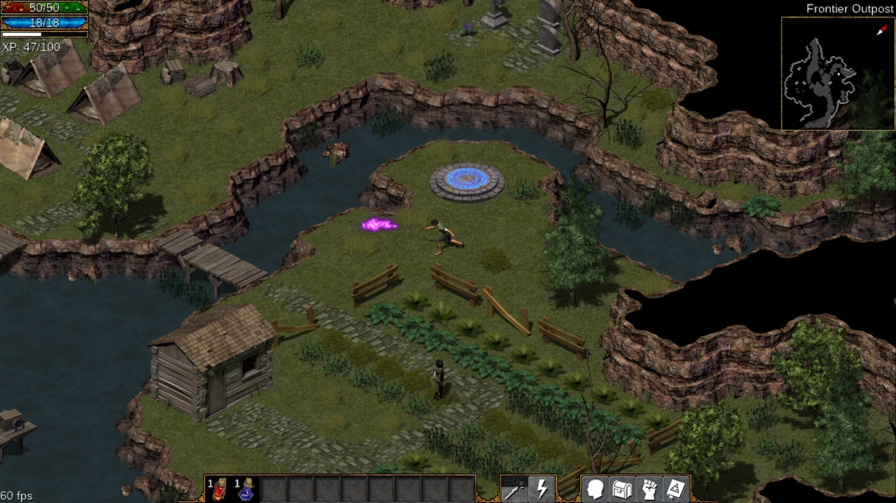

# Flare

Flare is a single-player 2D action RPG with fast-paced action and a dark fantasy style.

It is built on the FLARE engine (Free/Libre Action Roleplaying Engine). Its repo is at https://github.com/flareteam/flare-engine

Flare uses simple file formats (INI style config files) for most of the game data, allowing anyone to easily modify game contents. Open formats are preferred (png, ogg). Maps are edited using Tiled.

For best results, please use the latest version of the FLARE engine with the game data in this repository. Using an older version of the engine could result in some game elements not working correctly.

The flare-game content contains depictions of violence, blood, and mild gore.

## Copyright and License

Flare (the game) is Copyright ©2010-2013 Clint Bellanger. Contributors retain copyrights to their original contributions.

The Flare Engine is released under GPL version 3 or later.

All of Flare's art and data files are released under CC-BY-SA 3.0. Later versions are permitted.

The Liberation Sans fonts version 2 are released under the SIL Open Font License, Version 1.1.

The GNU Unifont font is released under GPL v2, with the exception that embedding the font in a document does not in itself bind that document to the terms of the GPL.

## Links

* Homepage  http://flarerpg.org
* Repo      https://github.com/flareteam/flare-game
* Binaries  https://sourceforge.net/projects/flare-game/
* Forums    http://opengameart.org/forums/flare
* Email     clintbellanger@gmail.com

## Running on Switch

Download the zip archive from the releases, dezip the archive.
Copy the "flare" folder in switch folder on micro SD card.

The mods folder should be in the same directory as the flare executable when building from source.

Flare Game is installed as a set of mods for Flare Engine. Place the contents of the "mods" folder inside Flare Engine's mods folder.

Then enable these mods in Flare's Configuration screen.

    fantasycore
    empyrean_campaign

## Settings

Settings are stored in this place:

    /switch/flare/config/

Here you can enable fullscreen, change the game resolution, enable mouse-move, and change keybindings. The settings files are created the first time you run Flare.

## Save Files

Save files are stored in this place:

    /switch/flare/saves/

If permissions are correct, the game is automatically saved when you exit.

### Building for Switch

Clone the repos:

	git clone https://github.com/Riviera71/flare-engine
	

Move to the flare-engine repo and build:
For instructions more in detail see the INSTALL file in the
flare-engine repo.

	cd flare-engine
	make -f Makefile.NX

## Command-line Flags

| Flag              | Description
|-------------------|----------------
| `--help`          | Prints the list of command-line flags.
| `--version`       | Prints the release version.
| `--data-path`     | Specifies an exact path to look for mod data.
| `--debug-event`   | Prints verbose hardware input information.
| `--renderer`      | Specifies the rendering backend to use. The default is 'sdl\_hardware'. Also available is 'sdl', which is a software-based renderer.
| `--no-audio`      | Disables sound effects and music.
| `--mods`          | Starts the game with only these mods enabled.
| `--load-slot`     | Loads a save slot by numerical index.
| `--load-script`   | Execute's a script upon loading a saved game. The script path is mod-relative.
